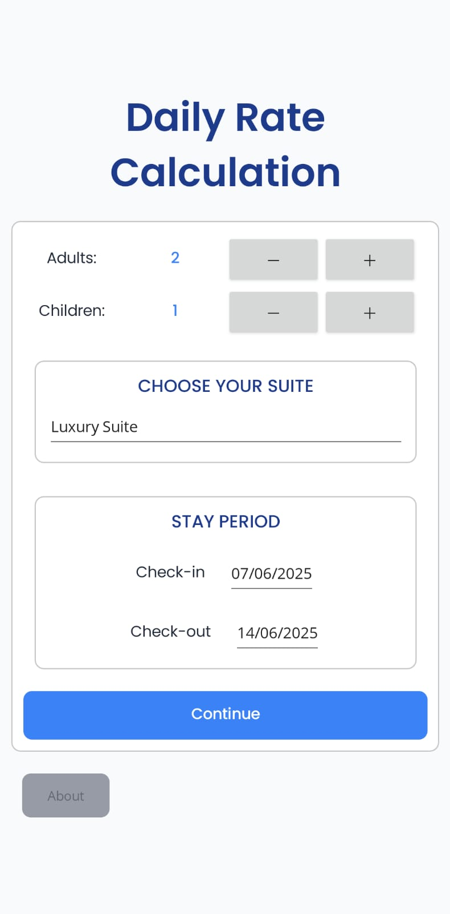
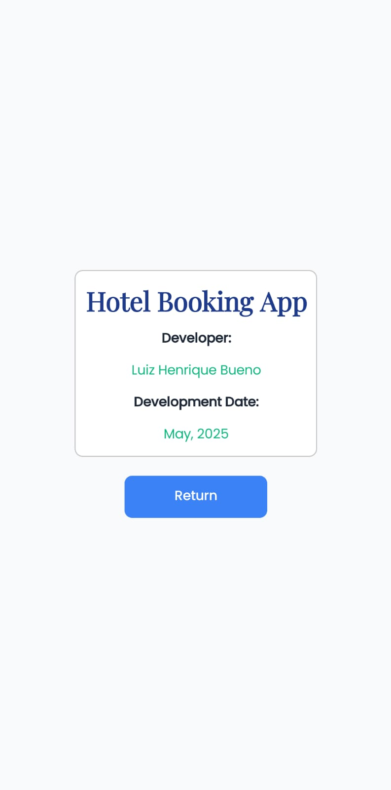
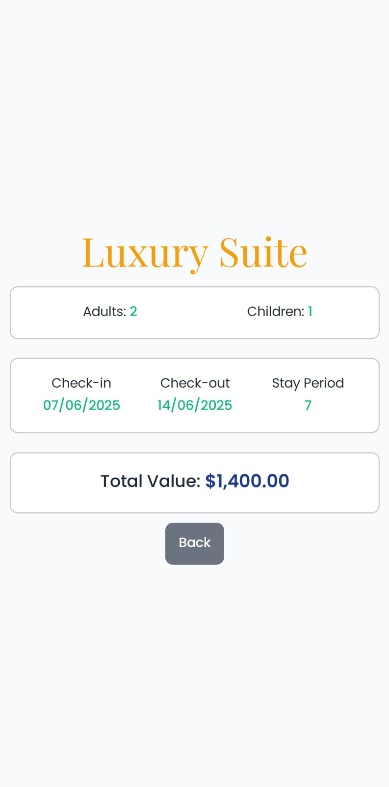

# Hotel Booking App

<div align="center">
  
  
  
  
</div>

<div align="center">
  <h3>A cross-platform hotel booking application built with .NET MAUI</h3>
  <p>Calculate daily rates, select accommodations, and manage hotel stay reservations</p>
</div>

---

## Application Overview

This Hotel Booking App is a cross-platform mobile application developed using .NET MAUI that provides users with an interface to:

- Calculate daily rates based on number of adults and children
- Select hotel accommodations from available suite options
- Choose check-in and check-out dates with an integrated date picker
- View total booking costs with detailed breakdown
- Access app information and developer details

The application features a modern design with selected color schemes and typography for cross-device compatibility.

---

## Application Screenshots

<div align="center">

### Main Booking Interface
*Select your perfect accommodation*



---

### About Page
*Application details and developer information*



---

### Booking Confirmation
*Review your reservation details and total costs*



</div>

---

## Design Features

<div align="center">
  <table>
    <tr>
      <td align="center">
        <br>
        <strong>Modern Interface</strong><br>
        <em>Clean and intuitive design</em>
      </td>
      <td align="center">
        <br>
        <strong>Responsive Layout</strong><br>
        <em>Optimized for all screen sizes</em>
      </td>
      <td align="center">
        <br>
        <strong>Premium Fonts</strong><br>
        <em>Poppins & Playfair Display</em>
      </td>
    </tr>
  </table>
</div>

---

## Technical Stack

- **Framework:** .NET MAUI (Multi-platform App UI)
- **Language:** C#
- **UI:** XAML with modern styling
- **Platform:** Cross-platform (iOS, Android, Windows, macOS)
- **Architecture:** MVVM Pattern
- **Design System:** Custom color palette with consistent theming

---

## Key Features

```
Interactive Elements
├── Stepper controls for guest count
├── Date picker for stay duration
├── Dropdown suite selection
└── Real-time price calculation

Modern Design
├── Consistent color scheme
├── Mobile-first approach
├── Premium typography
└── Smooth user experience
```

---
